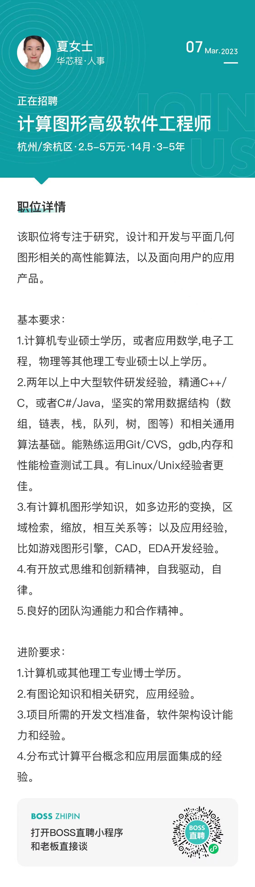

## linux内核开发工程师/专家

## 简历

### 项目经历

#### 某分布式作业系统的客户端软件项目
C++/QT软件开发工程师
本项目提供易用、架构稳定的客户端软件，该软件为客户提供分布式作业配置，提交，结果的交互界面。本人主要
1. 负责软件整体框架设计和开发。累计贡献代码量超过1W行，提供基础组件几十个；
2. 负责设计和开发GDS版图浏览器。协同底层版图库组件，通过识别端到端性能瓶颈进行了多轮优化，目前性能已基本持平业界竞品软件（Klayout）；
3. 参与软件质量守护和架构优化。作为Committer（开发约25人，committer共3人）负责代码检视、合入，月均输出约三十余条有效检视意见；负责CI/CD框架搭建、维护以及培训；开展多轮腐化代码重构。

#### 某分布式作业系统项目（HPC）
C++软件开发工程师
本项目向客户提供软硬件兼顾的分布式高性能集群作业系统，主要运用于气象预报，计算模拟以及基因测序等场景。本人主要
1. 分析，识别大规模业务场景下（1W core）集群存在的性能瓶颈和稳定性问题，并进行对应提升。输出性能调优经验十余篇，性能分析工具若干，发现和解决多个严重阻塞问题。
2. 接手并维护遗留数据库模块，通过代码重构和守护用例的完善，解决了该模块长期问题不收敛，功能不稳定等严重问题。

<!--  -->